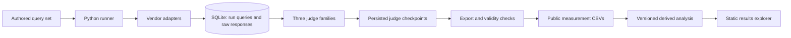

# Vannaris

An evaluation pipeline for the search APIs that AI agents and RAG systems call. It compares five vendors on an authored query set, scores responses with judges from three model families, and publishes the measurements, uncertainty, and missing data needed to inspect the result.

The engineering problem is making a comparison trustworthy when APIs fail, judges disagree, and the apparent winner depends on which observations survived. The repository includes a resumable Python runner, SQLite evidence storage, a public-data analysis pipeline, a static results explorer, and an offline failure-and-recovery demo.

[Public site](https://vannaris.com) · [Engineering case study](docs/18-engineering-case-study.md) · [Current state](CURRENT-STATE.md) · [Implementation plan](IMPLEMENTATION-PLAN.md)

## Try it without API keys

Requirements: Python 3.13, Node 22, npm, and `make`. Setup installs the locked dependencies; it does not call any vendor or judge API.

```bash
make setup
make check
make demo
```

Open **http://127.0.0.1:8000/demo.html**. The demo generates synthetic queries, mock responses, and a database under `.demo/`. It exercises persistence, interrupted judging, and recovery without credentials or API spend. Its outputs are labelled synthetic and never replace the measured archive in `site/`. Stop the server with Ctrl+C.

For the published measurements:

```bash
make serve
```

Open **http://127.0.0.1:8000/**. Run these servers one at a time, since both use port 8000. The results explorer supports selecting a published run, filtering queries, and inspecting each vendor's per-judge evidence.

`make demo-build` generates the demo without starting a server. Install Chromium once with `make setup-browser`; then `make check-browser` checks the measured archive, `make check-demo-browser` checks the generated demo, and `make verify` runs the offline gate and both browser checks. See the [90-second walkthrough](release/DEMO-WALKTHROUGH.md).

Optional: with Chromium and `ffmpeg` installed, `make demo-video` creates `.artifacts/release/vannaris-demo.mp4`, a cover image, and capture metadata. The clip is a 32-second walkthrough assembled from actual rendered demo frames, not a timed recording of pipeline execution or a performance benchmark.

## What was measured

The latest committed API measurement is **2026-W35, retrieved on August 24, 2026**. The archive contains four published weeks: W31, W33, W34, and W35. Two were scheduler-delivered; W32 is a permanent gap. This release adds code and recomputes derived analysis from published CSVs. It does not create a new live benchmark run or change historical retrieval dates.

The standard set contains 150 public queries across six categories and five vendors: Exa, Perplexity, Serper, You.com, and Linkup. The ensemble has judges from Anthropic, OpenAI, and Google. The W35 run also retrieved 30 preregistered withheld questions. Its public responses had complete three-judge panels for 530 of 750 calls, or 70.7%; that missingness remains visible.

One blinded human calibration on W31 recorded 280 screens. On its decisive stratum, the ensemble agreed with the labeller on 117 of 148 scored pairs: 79.1%, with a 95% Wilson interval of 71.8–84.8%. This supports a limited statement about pairwise ordering on that sample. It does not validate absolute 0–10 scores, provide agreement between independent human labellers, or establish validity on later runs.

These limits are part of the result. See [CURRENT-STATE.md](CURRENT-STATE.md) for evidence and open work, and [methodology](https://vannaris.com/methodology.html) for the published explanation. The public website is the previously published surface; local release changes require a separate deployment.

## How the system works



New runs store their inputs rather than inferring them from a later query file; legacy fallbacks remain explicitly identified. Vendor responses persist before judging, accepted judge calls are checkpointed, and recovery targets missing work while preserving the original run identity and timestamp. Publication applies completeness and category-coverage rules; a partial category cannot quietly become a comparable overall score.

The `publication-v3` derived-analysis revision uses category-stratified bootstrap intervals, paired sign-flip tests, and Holm correction across the declared comparison family. Published tiers mean the analysis did not resolve a difference; they do not prove equivalence. Quality scores are conditional on API success, with vendor availability and judge missingness reported separately. See the [case study](docs/18-engineering-case-study.md) for assumptions and tradeoffs.

## Inspect the public evidence

No API keys are needed to inspect the real measurements:

- [`site/export/manifest.json`](site/export/manifest.json) identifies the latest run and released files.
- [`site/export/judge-scores-2026-W35.csv`](site/export/judge-scores-2026-W35.csv) contains individual judge scores.
- [`site/export/responses-2026-W35.csv`](site/export/responses-2026-W35.csv) contains timing, cost, errors, and response counts.
- [`site/export/queries.csv`](site/export/queries.csv) contains the public question set.
- [`site/data/latest.json`](site/data/latest.json) contains the derived result displayed by the site.

Public recomputation starts from these released measurements. It is different from replaying the original API calls or rejudging their raw content: raw responses are deliberately excluded from Git and public downloads.

The analysis is implemented in [`src/inference.py`](src/inference.py) and [`scripts/recompute_publication.py`](scripts/recompute_publication.py). After setup, verify the released-input recomputation without writing files:

```bash
.venv/bin/python scripts/recompute_publication.py --check
```

## Paid live evaluation

Live evaluation needs five vendor accounts and three judge accounts. Both a key check and a smoke run make paid API calls. Configure credentials locally from `.env.example`; never put values into an issue, a PR, or a committed file.

```bash
cp -n .env.example .env
# Add your own credentials to .env locally.
.venv/bin/python scripts/check_keys.py --require-all
.venv/bin/python -m src.runner --queries src/queries/full-v1.json --limit 5
```

A smoke run is not a publishable week. A complete run uses the full set without `--limit`. Exporting requires a qualified database; raw content stays local. Changes to the vendor set, judge pins, scoring rules, or registered withheld set require the review described in [CONTRIBUTING.md](CONTRIBUTING.md) and [AUTONOMY.md](AUTONOMY.md).

`--rejudge RUN_ID` reuses stored responses and requests missing judge work. `--resume RUN_ID` also fetches missing query/vendor pairs, restricted to the original UTC retrieval date; it cannot backfill a past day or week. Both can make paid calls. Configure optional encrypted workflow recovery using the owner's public X.509 certificate as `VANNARIS_RECOVERY_CERT`; the private key stays outside Actions. Without that configuration, the workflow uploads sanitized status only. Historical remote artifacts have not been audited or deleted by this release.

## Repository map

| Path | Responsibility |
| --- | --- |
| `src/runner.py` | Fetching, persistence, checkpointed judging, recovery, run validity |
| `src/vendors/` | Vendor adapters and normalized response model |
| `src/judge/ensemble.py` | Judge calls, pinned models, rubric, score parsing |
| `src/storage/` | SQLite schema and migrations |
| `src/export.py` | Publication boundary and generated data |
| `src/calibrate.py` | Blinded human labelling tasks and analysis |
| `src/demo.py` | Offline synthetic failure-and-recovery pipeline |
| `site/` | Measured archive and static explorer |
| `tests/`, `scripts/` | Offline correctness, publication, accessibility, and browser checks |
| `release/` | Local demo walkthrough and an unpublished launch-post draft |
| `docs/`, `applications/`, dated root reports | Preserved research and decision history |

The old working name “SearchBench” remains in historical records. [CURRENT-STATE.md](CURRENT-STATE.md) supersedes their descriptions of current implementation; it does not rewrite the observations or decisions recorded there.

## Licences

Code: [MIT](LICENSE). Published measurements and question sets: [CC BY 4.0](LICENSE-DATA). Retrieved vendor URLs, titles, snippets, and synthesized answers are not included in the public data licence. Cite the run, retrieval date, and analysis revision when using a derived result.
