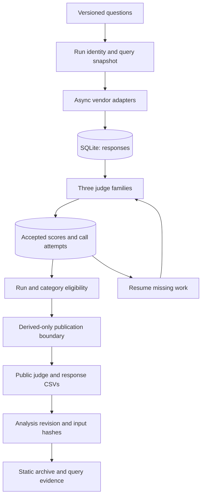

# 18 — Vannaris: making an API evaluation pipeline inspectable

Engineering case study, October 4, 2026. This describes the portfolio engineering release and the historical measurements it preserves. Development and validation use offline evidence; the release does not supply new live benchmark observations or an independent human study.

## Problem

An AI agent using web search must choose among APIs with different output shapes, price bases, latency, and reliability. A table of five average scores makes that choice look easy. Producing a table people can inspect is harder: API failures select which answers are scored, model judges disagree, prompts can truncate, category coverage differs, and recovering a failed run must not silently change the experiment.

Vannaris evaluates five vendors on the same authored questions with judges from three model families. It publishes released measurements and the assumptions behind their comparisons. The engineering contribution is the whole backend pipeline: collection, checkpointed judging, storage, recovery, statistical analysis, and an accessible evidence explorer.

The system boundary is a scheduled batch pipeline with a static publication artifact. It does not require user accounts, a hosted API proxy, or distributed services to perform that job.

## Architecture



| Boundary | Why it exists | Implementation |
| --- | --- | --- |
| Vendor adapter | External payload differences stay outside scoring | `src/vendors/base.py`, `src/vendors/adapters.py` |
| Run-bound input snapshot | Old observations retain the questions actually asked | `src/runner.py`, `src/storage/` |
| Response persistence | Judge failure cannot erase paid retrieval evidence | `src/runner.py` |
| Per-family checkpoint | Recovery reuses accepted work and retries missing calls | `src/runner.py`, `src/judge/ensemble.py` |
| Publication boundary | Raw vendor content cannot enter public exports | `src/export.py` |
| Derived-analysis revision | Correcting statistics is distinct from recollecting data | `src/inference.py`, `scripts/recompute_publication.py`, generated provenance |
| Static explorer | Public results stay cheap to serve and inspect | `site/`, `site/assets/` |
| Synthetic demo | Reviewers exercise failure and recovery without accounts | `src/demo.py`, `.demo/` output |

SQLite fits the execution model: runs have stable identities and relational observations, handled by one batch pipeline. Local persistence avoids making a hosted database a prerequisite for viewing results. Static HTML/CSS/JavaScript fits publication: generated exports supply displayed claims, and the dashboard never needs to hold credentials or call a search vendor.

## Failures that shaped the design

### Judging failed after retrieval succeeded

Earlier runs spent vendor money and then lost judge work to quota failures or truncated replies. The initial correction persisted responses before judging. The release extends that boundary with input snapshots, individual retrieval checkpoints, accepted-score checkpoints, and recorded failed attempts. Recovery revisits the original run rather than assigning it today's date or treating a new query file as the original input.

`--rejudge RUN_ID` uses stored responses and retries missing judge families/models without vendor calls. `--resume RUN_ID` can also retrieve missing query/vendor pairs, but only on the original UTC retrieval date. It refuses to silently mix fresh responses from later days into an older run. Response checkpoint times preserve the observed collection window separately from a later judging date. Accepted scores are append-only. A legacy run that lacks a stored query snapshot has an explicitly identified fallback; the code does not invent missing historical inputs.

The invariant is observable: inject a failure, reopen the stored run, recover, and prove that completed work and original metadata survived. The demo uses 120 synthetic questions, three synthetic vendors, and real request/parser paths over `httpx.MockTransport`. One deliberately invalid vendor payload is retained as a failure. The first judge pass lacks Google and cannot publish. Recovery calls the missing judge family, preserves accepted scores, and makes no new vendor calls.

The default scenario persists 360 mock response envelopes, including the one injected vendor error. The first pass retains 718 accepted scores; recovery requests 359 missing Google judgments and produces 359 complete panels. Actual API spend is zero. Those are counts from the synthetic scenario, not vendor performance findings or measurements of production savings.

This establishes the local persistence and recovery behavior. It does not measure real vendor reliability or prove that today's paid accounts have enough quota.

### A green test suite did not mean tests ran

A test class once had a helper named `run`, overriding `unittest.TestCase.run`. Its tests were collected but never executed. [`tests/test_the_tests.py`](../tests/test_the_tests.py) guards that failure. The strict repository gate likewise distinguishes missing validation from successful validation.

Unit behavior, export invariants, DOM checks, and browser interaction have different evidence. This release checks them separately; none alone establishes the other properties.

### Small score differences invited larger claims

The original score scale crowded toward its ceiling. A stricter rubric shifted scores without improving which pairs separated. A candidate hard-question tier missed its target, and selecting its hardest questions also selected apparent spread. Those experiments remain preserved in [`16-rubric-saturation-experiment-2026-08-17.md`](16-rubric-saturation-experiment-2026-08-17.md) and [`17-taxonomy-v3-decisions-and-pilot-2026-08-17.md`](17-taxonomy-v3-decisions-and-pilot-2026-08-17.md).

The original quality-routing idea had little gain on the measured set. That result matters: another ranking decimal or a router implementation would not fix limited resolution.

The release corrects what can be corrected without new observations: eligible categories, paired uncertainty, multiplicity, missingness, and provenance. It does not claim those corrections make the questions representative or establish human-validated absolute scores.

## Analysis decisions

A response enters quality analysis with a complete three-family panel, using the median of its three overall judgments. A category cell averages those response scores subject to its coverage floor. An overall score requires all six qualified cells with equal weights; missing categories cannot make a different query mix easier for one vendor.

The `publication-v3` revision uses a deterministic, category-stratified query bootstrap with 10,000 replicates and 95% percentile intervals. Paired vendor differences average category-level paired means. Overall inference requires at least two common scored questions in each category. The interval describes uncertainty under that empirical sampling scheme, not every future search task or all judge drift.

Paired significance uses a two-sided sign-flip test: exact enumeration for at most 16 nonzero differences, otherwise 4,999 seeded draws with an add-one probability. Holm correction covers the declared family of vendor pairs across the overall and six category comparisons. A reported separation also requires the bootstrap interval to exclude zero.

Sign flips assume exchangeable signs under the paired null. Category weights are fixed, and incomplete observations remain a limitation. Shared tiers mean a difference was unresolved under these rules; they are not proof of equivalence or a claim that every pair in a tier is equally good.

Quality is conditional on API success. Vendor errors and missing judge panels remain separate. Full-panel disagreement uses full panels only. The public/withheld gap is a diagnostic affected by difficulty and sampling, not proof of overfitting.

Vendor responses also differ by output mode and product tier: some supply ranked snippets, while a synthesis product can supply an answer alongside results. The historical scores describe those collected payloads under the recorded configuration. They do not prove equal retrieval budgets or isolate retrieval-only quality from answer generation. A controlled comparison is further experimental work, not something a statistical correction can reconstruct.

## Evidence and its limits

| Evidence | Supports | Does not establish |
| --- | --- | --- |
| Four published weeks, two scheduled | Historical public record with named gaps | Operation after the latest August 24 measurement |
| Public judge/response CSVs | Aggregate and analysis recomputation | Replay of raw content or current API behavior |
| One W31 human pairwise calibration | Agreement on a bounded blinded sample | Absolute-score validity, independent human agreement, later-run validity |
| Offline recovery demo | Persistence and resumption through real local paths | Provider uptime, funding, or external quotas |
| Unit/export/site/browser checks | Implemented invariants and exercised interactions | Adoption, customer savings, an independent study |
| Analysis revision and input hashes | Released observations behind a corrected result | New responses or a new retrieval date |

The completed human pass has 280 screens and one labeller. It agreed on 117 of 148 decisive scored pairs (79.1%; Wilson 95% interval 71.8–84.8%). The human also separated 48 of 50 near-tie pairs. This is evidence about the instrument's resolution and a reason to seek independent evaluation, rather than a universal “human verified” badge.

Raw URLs, titles, snippets, and synthesized answers remain outside public data. Public reproducibility begins from released measurements. The workflow now uploads sanitized run status; optional private recovery requires an owner-provided public X.509 recipient certificate and CMS-encrypted storage. The private recovery key stays outside Actions. This task did not audit or remove historical remote artifacts or perform a live encrypted-workflow run.

## Engineering evidence to inspect

| Guarantee | Inspect |
| --- | --- |
| Historical inputs survive later edits; query snapshots cannot be updated/deleted | [`tests/test_runner.py`](../tests/test_runner.py), [`src/storage/lifecycle.py`](../src/storage/lifecycle.py) |
| Incomplete export refuses; recovery reuses accepted work; measured site stays untouched | [`tests/test_demo.py`](../tests/test_demo.py), [`src/demo.py`](../src/demo.py) |
| A manual publish does not satisfy scheduled heartbeat; ISO week 53 handled | [`tests/test_operational_status.py`](../tests/test_operational_status.py) |
| Sanitized status excludes raw content; encrypted evidence roundtrip restores bytes | [`tests/test_operational_status.py`](../tests/test_operational_status.py), [`scripts/encrypt_recovery.py`](../scripts/encrypt_recovery.py) |
| Statistical implementation and released-input provenance | [`src/inference.py`](../src/inference.py), [`scripts/recompute_publication.py`](../scripts/recompute_publication.py), [`tests/test_export_guards.py`](../tests/test_export_guards.py) |
| Real browser interaction and rendering | [`scripts/check-browser.mjs`](../scripts/check-browser.mjs) |

These are executable evidence paths. The integrated release validation reports which commands passed and what external checks were not performed; do not treat this table as a live-provider audit.

## Reproduce the engineering demo

```bash
make setup
make setup-browser
make verify
make demo
```

Open http://127.0.0.1:8000/demo.html and follow the [walkthrough](../release/DEMO-WALKTHROUGH.md). `make verify` combines offline checks, browser checks, and demo generation. Stop the server before using `make serve` for the measured archive. No vendor/judge credentials are needed.

## Scope and next evidence

The next research improvement is a preregistered independent human audit or parallel objective-scoring experiment with a bounded question and held-out evaluation. It requires real participants or curated ground truth, budget for any external calls, and a report that preserves null results.

Accounts, payments, a speculative router, a hosted proxy, and distributed infrastructure increase system boundaries without validating the measurements. The bounded release is a local, reviewable evaluation system; the broader research program remains open.
